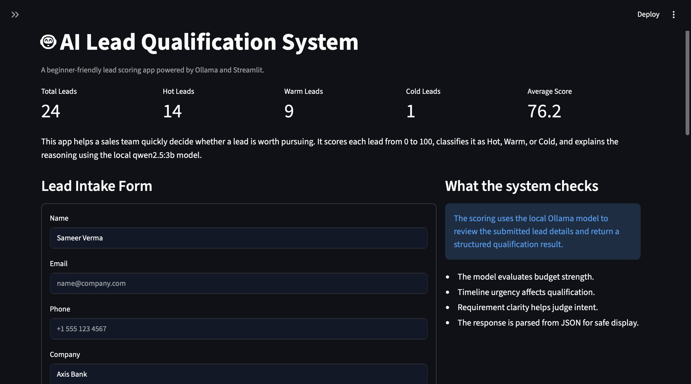
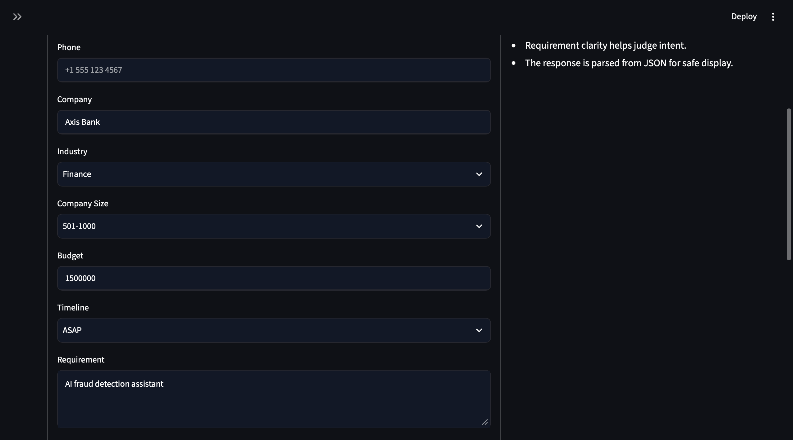
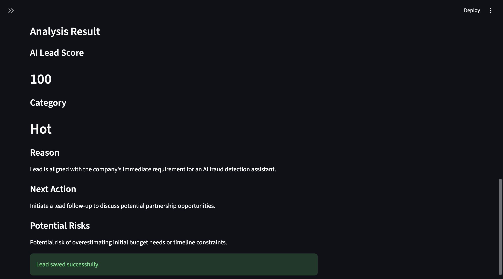
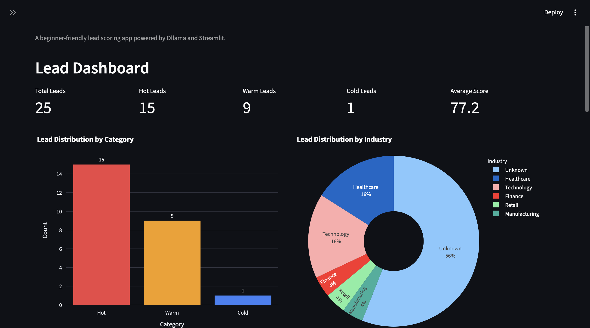
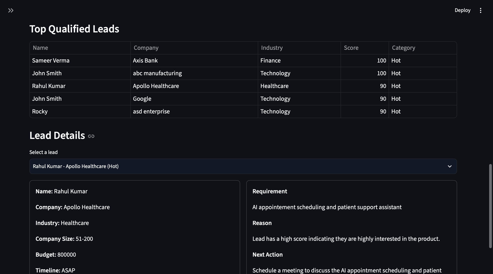
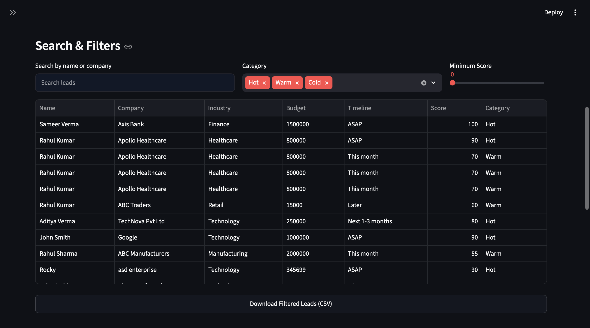
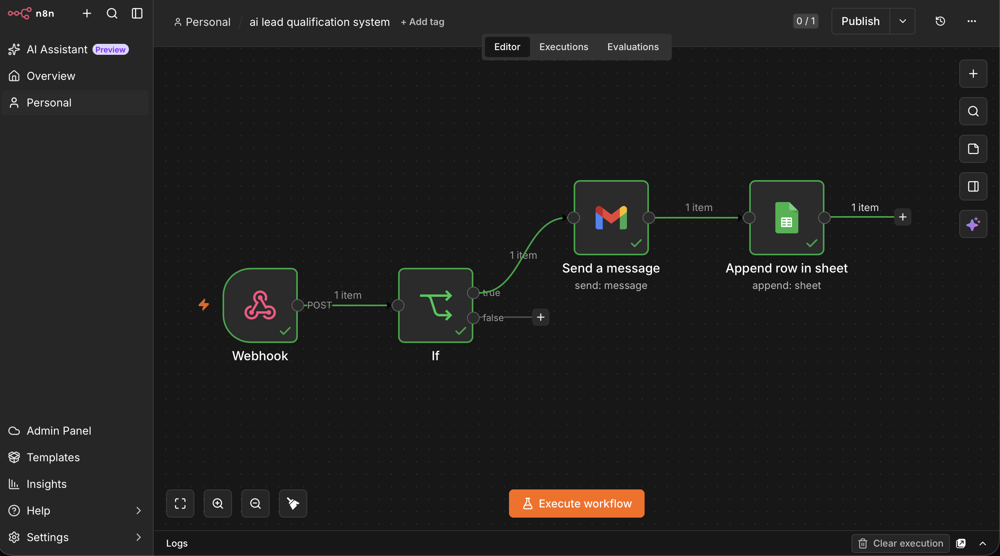
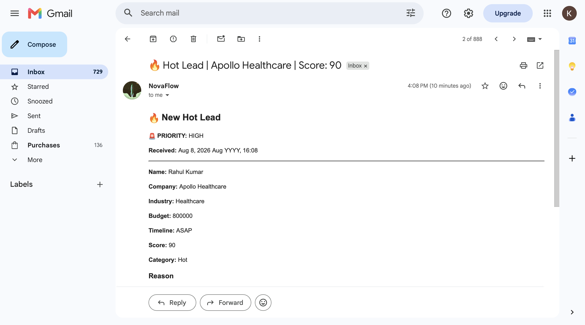
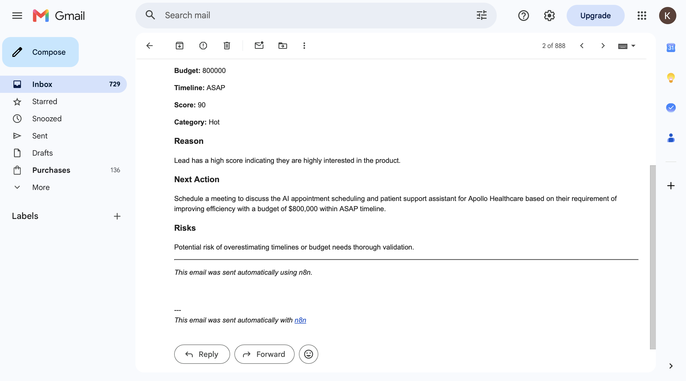
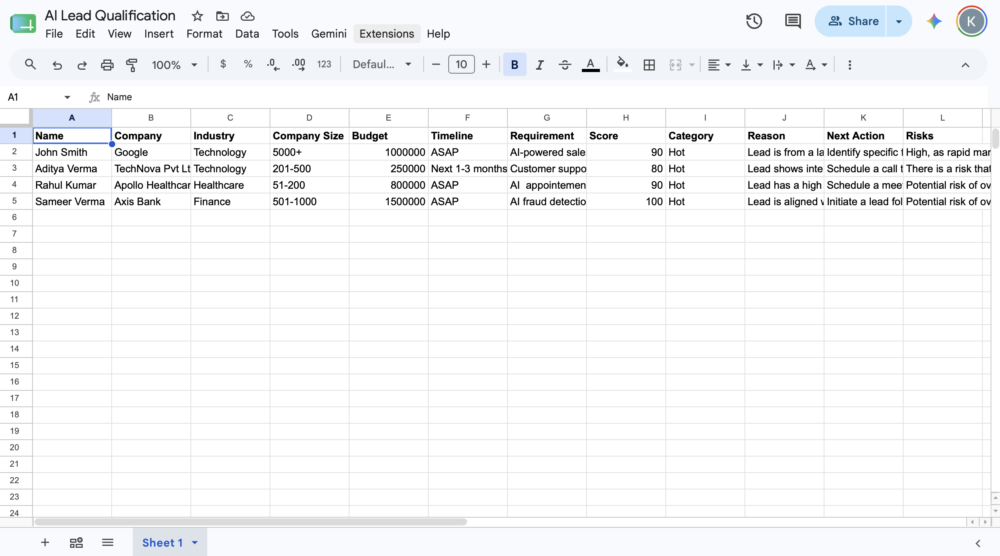

# AI Lead Qualification & Sales Automation Platform

An AI-powered lead qualification and sales automation platform built with Python and Streamlit.

The system combines deterministic business rules with configurable AI providers to qualify sales leads, generate actionable sales guidance, store lead data in Supabase, and automatically trigger downstream workflows through n8n.

---

## 🚀 Overview

The platform helps sales teams evaluate incoming leads and quickly determine which opportunities deserve attention.

Each lead receives:

- A deterministic score from **0–100**
- A classification: **Hot, Warm, or Cold**
- AI-generated reasoning
- A recommended next sales action
- Potential risks or uncertainties

After qualification, the lead is persisted in the database and sent to an n8n production webhook for automated downstream processing.

The system supports both:

- **Google Gemini** for cloud-based AI analysis
- **Ollama + Qwen 2.5:3b** for local AI inference

The AI provider can be switched through configuration without changing the application logic.

---

## ✨ Features

### Lead Qualification

- Deterministic business-rule scoring
- Score range from 0–100
- Hot / Warm / Cold classification
- Budget analysis
- Timeline analysis
- Company-size consideration
- Requirement-based qualification

### AI Sales Analysis

Supports multiple AI providers:

- Google Gemini
- Local Ollama
- Qwen 2.5:3b

AI generates:

- Lead reasoning
- Recommended next action
- Potential risks

The AI does not recalculate the deterministic score.

### Dashboard

The Streamlit dashboard provides:

- Total leads
- Hot leads
- Warm leads
- Cold leads
- Average score
- Lead category distribution
- Industry distribution
- Lead search
- Category filtering
- Minimum-score filtering
- Score sorting
- Top qualified leads
- Detailed lead inspection
- CSV export

### Database

- Supabase production database
- SQLite support for local development
- Existing SQLite data can be migrated using the included migration script

### Automation

n8n production webhook integration provides automated downstream workflows.

Current automation includes:

- Gmail notifications
- Google Sheets lead logging

### Deployment

The application is designed to run locally and in a deployed Streamlit environment.

Production configuration can be supplied through Streamlit Secrets.

---

# 🏗️ Architecture

```text
                         ┌─────────────────────────┐
                         │      Streamlit App      │
                         │    Lead Analyzer UI     │
                         └────────────┬────────────┘
                                      │
                                      ▼
                         ┌─────────────────────────┐
                         │  Deterministic Scoring  │
                         │        0–100 Score       │
                         └────────────┬────────────┘
                                      │
                                      ▼
                         ┌─────────────────────────┐
                         │      AI Provider        │
                         └────────────┬────────────┘
                                      │
                         ┌────────────┴────────────┐
                         ▼                         ▼
                  ┌──────────────┐          ┌──────────────┐
                  │    Gemini    │          │    Ollama    │
                  |gemini-3.1.   │          │ Qwen 2.5:3b  │
                  │flash lite    │          │ Local Model  │
                  └──────────────┘          └──────────────┘
                                      │
                                      ▼
                         ┌─────────────────────────┐
                         │        Supabase         │
                         │   Production Database   │
                         └────────────┬────────────┘
                                      │
                                      ▼
                         ┌─────────────────────────┐
                         │      n8n Webhook        │
                         │   Production Workflow   │
                         └────────────┬────────────┘
                                      │
                         ┌────────────┴────────────┐
                         ▼                         ▼
                  ┌──────────────┐          ┌──────────────┐
                  │    Gmail     │          │Google Sheets │
                  │ Notification │          │ Lead Logging │
                  └──────────────┘          └──────────────┘
```

---

# 🧠 How Lead Qualification Works

## 1. Lead Input

The salesperson submits information such as:

- Name
- Company
- Industry
- Company Size
- Budget
- Timeline
- Business Requirement

---

## 2. Deterministic Scoring

The application first evaluates the lead using predefined business rules.

The scoring system produces:

```text
Score: 0–100
Category: Hot / Warm / Cold
```

This provides a consistent and predictable qualification baseline.

---

## 3. AI Sales Analysis

The configured AI provider receives the lead information together with the existing score and category.

The AI does **not** change or recalculate the score.

Instead, it provides contextual sales guidance:

### Reason

Explains why the lead fits its current category and identifies important buying signals.

### Next Action

Provides one practical action for the salesperson to take next.

### Risks

Identifies relevant uncertainties, missing information, or potential obstacles based only on the available lead data.

---

## 4. Database Persistence

After qualification, the lead is saved to the configured database.

Production deployments use **Supabase**.

The stored information includes:

- Lead information
- Score
- Category
- AI reasoning
- Recommended next action
- Risks

---

## 5. Automation

After the lead is processed, the application sends the lead payload to an n8n production webhook.

n8n handles downstream automation such as:

```text
Lead
  ↓
n8n Production Webhook
  ↓
 ┌───────────────┬─────────────────┐
 ↓               ↓
Gmail       Google Sheets
```

The application is designed so that an external automation failure does not prevent the core lead-processing workflow from functioning.

---

# 📊 Dashboard

The dashboard provides an overview of the saved leads.

### KPI Metrics

- Total Leads
- Hot Leads
- Warm Leads
- Cold Leads
- Average Score

### Analytics

- Lead distribution by category
- Lead distribution by industry

### Lead Management

Users can:

- Search by name or company
- Filter by category
- Filter by minimum score
- Sort by highest score
- Sort by lowest score
- Review top qualified leads
- Inspect individual lead details
- Export filtered leads to CSV

---

# 🔥 Lead Categories

| Category | Description |
|---|---|
| 🔥 Hot | Strong buying signals and high qualification |
| 🟡 Warm | Potential opportunity requiring additional qualification |
| 🔵 Cold | Limited buying signals or significant uncertainty |

Scores range from **0 to 100**.

---

# 🤖 AI Providers

The application supports two AI providers.

## Google Gemini

Gemini provides cloud-based AI analysis.

Default model:

```text
gemini-3.1-flash-lite
```

Configuration:

```env
AI_PROVIDER=gemini
GEMINI_API_KEY=your_api_key
GEMINI_MODEL=gemini-3.1-flash-lite
```

---

## Ollama

Ollama provides local AI inference.

Default model:

```text
qwen2.5:3b
```

Configuration:

```env
AI_PROVIDER=ollama
OLLAMA_URL=http://localhost:11434
MODEL_NAME=qwen2.5:3b
```

Install the model locally:

```bash
ollama pull qwen2.5:3b
```

Make sure the Ollama server is available at:

```text
http://localhost:11434
```

---

# 🔄 Switching AI Providers

The AI provider is selected dynamically through configuration.

For example:

```env
AI_PROVIDER=gemini
```

or:

```env
AI_PROVIDER=ollama
```

The application does not require changes to the main application code when switching providers.

This makes it possible to use:

- Local AI during development
- Gemini in production

or any other supported configuration.

---

# 🔗 n8n Automation

The application sends qualified lead information to an n8n production webhook.

The payload includes:

```text
name
company
industry
company_size
budget
timeline
requirement
score
category
reason
next_action
risks
```

The n8n workflow can then:

1. Receive the qualified lead.
2. Process the payload.
3. Send a Gmail notification.
4. Add the lead to Google Sheets.

The webhook URL is configured through environment variables or Streamlit Secrets.

---

# 🗄️ Database

## Production

The production application uses:

```text
Supabase
```

for persistent lead storage.

## Local Development

SQLite can be used for local development and existing SQLite data can be migrated to Supabase using:

```text
migrate_sqlite_to_supabase.py
```

---

# 🛠️ Tech Stack

| Component | Technology |
|---|---|
| Programming Language | Python |
| Frontend | Streamlit |
| AI Provider 1 | Google Gemini |
| AI Provider 2 | Ollama |
| Local LLM | Qwen 2.5:3b |
| Lead Scoring | Deterministic Business Rules |
| Production Database | Supabase |
| Local Database | SQLite |
| Automation | n8n |
| Visualization | Plotly |
| HTTP Integration | Requests |
| Configuration | python-dotenv |
| Production Secrets | Streamlit Secrets |
| Notifications | Gmail |
| Lead Logging | Google Sheets |
| Deployment | Streamlit |

---

# 📁 Project Structure

```text
AI-Lead-Qualification/
│
├── app.py
│   └── Streamlit application, lead analyzer,
│       dashboard, analytics, filters and UI
│
├── database.py
│   └── Database connection and lead persistence
│
├── ai_client.py
│   └── Runtime AI provider selection
│
├── gemini_client.py
│   └── Google Gemini integration
│
├── ollama_client.py
│   └── Local Ollama integration
│
├── n8n_client.py
│   └── n8n webhook integration
│
├── migrate_sqlite_to_supabase.py
│   └── SQLite to Supabase migration utility
│
├── modules/
│   ├── __init__.py
│   └── lead_scoring.py
│       └── Deterministic lead scoring logic
│
├── requirements.txt
│   └── Python dependencies
│
├── .gitignore
│
└── README.md
```

---

# ⚙️ Configuration

## Local Development

Create a `.env` file in the project root.

Example:

```env
AI_PROVIDER=ollama

OLLAMA_URL=http://localhost:11434
MODEL_NAME=qwen2.5:3b

GEMINI_API_KEY=your_gemini_api_key
GEMINI_MODEL=gemini-3.1-flash-lite

DATABASE_URL=your_supabase_database_url

N8N_WEBHOOK_URL=your_n8n_webhook_url
```

Never commit your `.env` file or credentials to GitHub.

---

# ☁️ Production Configuration

Production deployments can use Streamlit Secrets.

Example:

```toml
AI_PROVIDER = "gemini"

GEMINI_API_KEY = "your_gemini_api_key"
GEMINI_MODEL = "gemini-3.1-flash-lite"

DATABASE_URL = "your_database_url"

N8N_WEBHOOK_URL = "your_production_webhook_url"
```

For security reasons, real credentials should never be placed directly in source code.

---

# 🚀 Installation

## 1. Clone the repository

```bash
git clone https://github.com/Kai-rgb-shifter/AI-Lead-Qualification.git
cd AI-Lead-Qualification
```

## 2. Create a virtual environment

```bash
python -m venv .venv
```

## 3. Activate the environment

### macOS / Linux

```bash
source .venv/bin/activate
```

### Windows

```bash
.venv\Scripts\activate
```

## 4. Install dependencies

```bash
pip install -r requirements.txt
```

## 5. Configure environment variables

Create the required `.env` configuration.

## 6. Start Streamlit

```bash
streamlit run app.py
```

---

# 🧪 Local Ollama Setup

Install Ollama and download the model:

```bash
ollama pull qwen2.5:3b
```

Verify that Ollama is running:

```text
http://localhost:11434
```

Then configure:

```env
AI_PROVIDER=ollama
```

---

# 🧪 Testing

Before deployment, Python files can be checked for syntax errors with:

```bash
python -m compileall app.py database.py ai_client.py gemini_client.py ollama_client.py n8n_client.py modules migrate_sqlite_to_supabase.py
```

The production workflow should also be tested end-to-end:

```text
Streamlit
   ↓
Lead Scoring
   ↓
AI Analysis
   ↓
Supabase
   ↓
n8n Production Webhook
   ↓
Gmail + Google Sheets
```

---

# 📸 Screenshots


## Lead Analyzer






## Dashboard





## n8n Production Workflow



## Gmail Notification




## Google Sheets



---

# 🔐 Security

Sensitive configuration should never be committed to source control.

Use:

- `.env` for local development
- Streamlit Secrets for production
- Environment variables for deployment configuration

Never commit:

- API keys
- Database passwords
- Private webhook URLs
- Authentication credentials
- Other sensitive secrets

---

# 📈 Production Workflow

The complete production workflow is:

```text
┌──────────────────┐
│ Salesperson      │
│ submits a lead   │
└────────┬─────────┘
         │
         ▼
┌──────────────────┐
│ Streamlit App    │
└────────┬─────────┘
         │
         ▼
┌──────────────────┐
│ Rule-Based Score │
│     0–100        │
└────────┬─────────┘
         │
         ▼
┌──────────────────┐
│ AI Sales Analysis│
│ Gemini / Ollama  │
└────────┬─────────┘
         │
         ▼
┌──────────────────┐
│     Supabase     │
│  Lead Persistence│
└────────┬─────────┘
         │
         ▼
┌──────────────────┐
│ n8n Production   │
│ Webhook          │
└────────┬─────────┘
         │
      ┌──┴──┐
      ▼     ▼
   Gmail  Sheets
```

---

# 🔮 Future Improvements

Potential future improvements include:

- User authentication
- Role-based access control
- Configurable scoring rules
- Lead status tracking
- Sales pipeline management
- Follow-up reminders
- Conversion tracking
- CRM integrations
- Additional n8n workflows
- Advanced dashboard analytics
- Automated test coverage
- Lead activity history
- Multi-user support

---

# 📄 License

No license has currently been specified for this project.

If this project is intended for public distribution or open-source use, add an appropriate license.

---

## 👨‍💻 Project

**AI Lead Qualification & Sales Automation Platform**

Built with:

**Python · Streamlit · Gemini · Ollama · Supabase · n8n · Plotly**